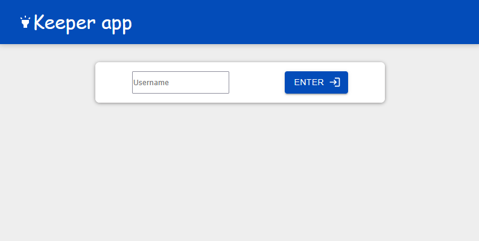
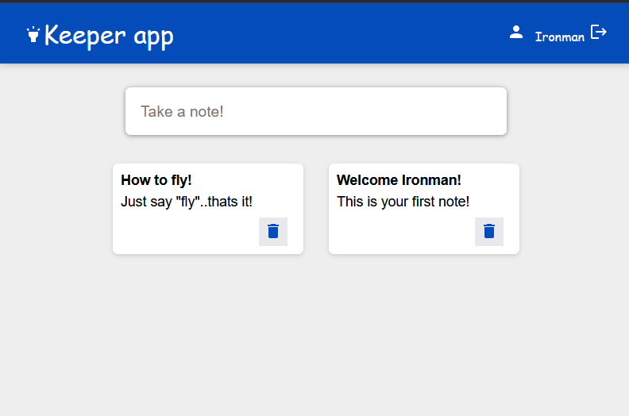
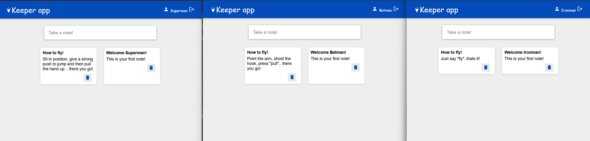

# Keeper Dapp

## Introduction

Keeper Dapp is a decentralized note-keeping application built on the Internet Computer Protocol (ICP).  
The frontend is developed using **React**, providing a modern and responsive user interface.  
The backend is written in **Motoko**, running as a canister smart contract on the ICP blockchain.

### Features
- Add, view, and delete notes securely.
- Data is stored on-chain using Motoko canisters.
- Modern UI with React.

## Snapshots

Here are sample snap shot!
### Login

### User Ironman

### Parallel 3 user instances


---

## How to Use

### 1. Clone the Repository

```bash
git clone https://github.com/yourusername/keeper-dapp.git
cd keeper-dapp
```
### 2. Install DFX SDK
Follow the [official guide](https://github.com/dfinity/docs/tree/main/modules/developers-guide/pages/cli-reference) to install DFX.

### 3. Install Dependencies
    npm install
### 4. Start the Local ICP Replica
    dfx start --background [add --clean for deploy clean]
### 5. Deploy Canisters
    dfx deploy
### 6. Launch the Frontend
- follow the link the command line to open the app frontend. Something like ```http://****-*****-******-abcd-efg.localhost:****/```
- if issues try ```npm start```

## About ICP, DFX, and Decentralized Apps
ICP (Internet Computer Protocol) is a blockchain network that enables smart contracts (canisters) to run at web speed and scale, supporting decentralized applications.

DFX is the command-line tool for managing ICP projects, including canister deployment, local replica management, and more.

Decentralized Apps (Dapps) are applications that run on a blockchain, providing transparency, security, and censorship resistance.

More at [official doc](https://internetcomputer.org/document-library/)!